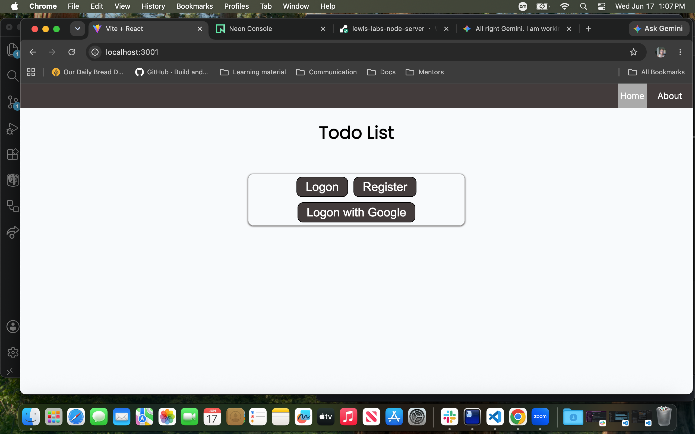
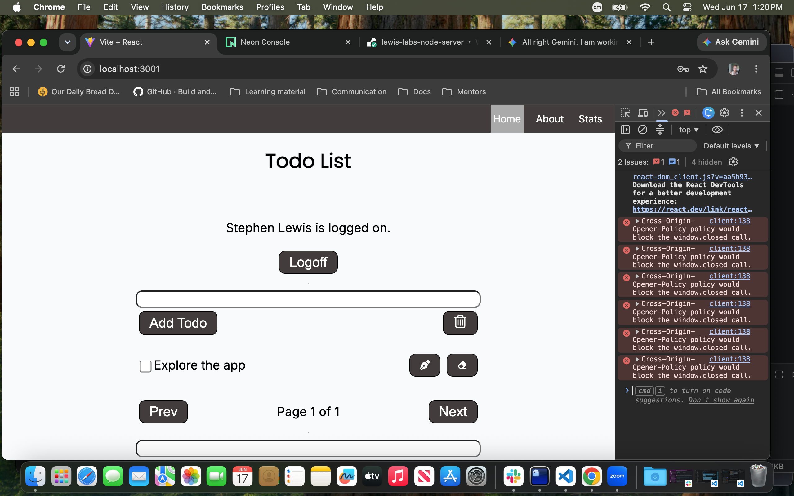
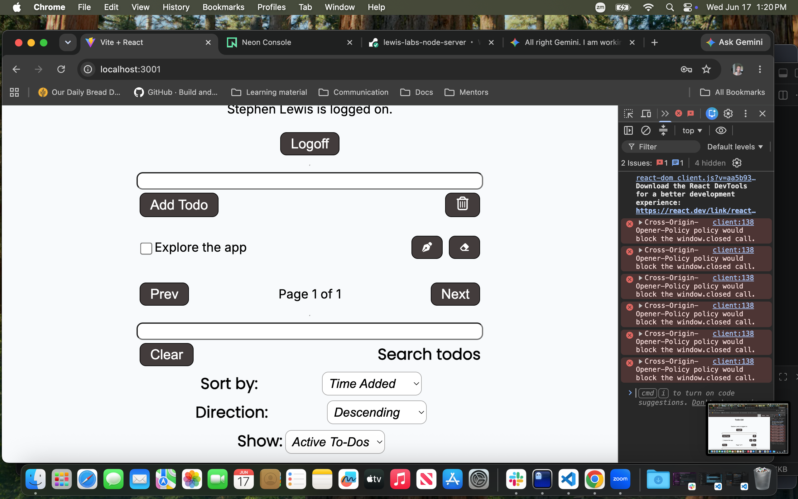
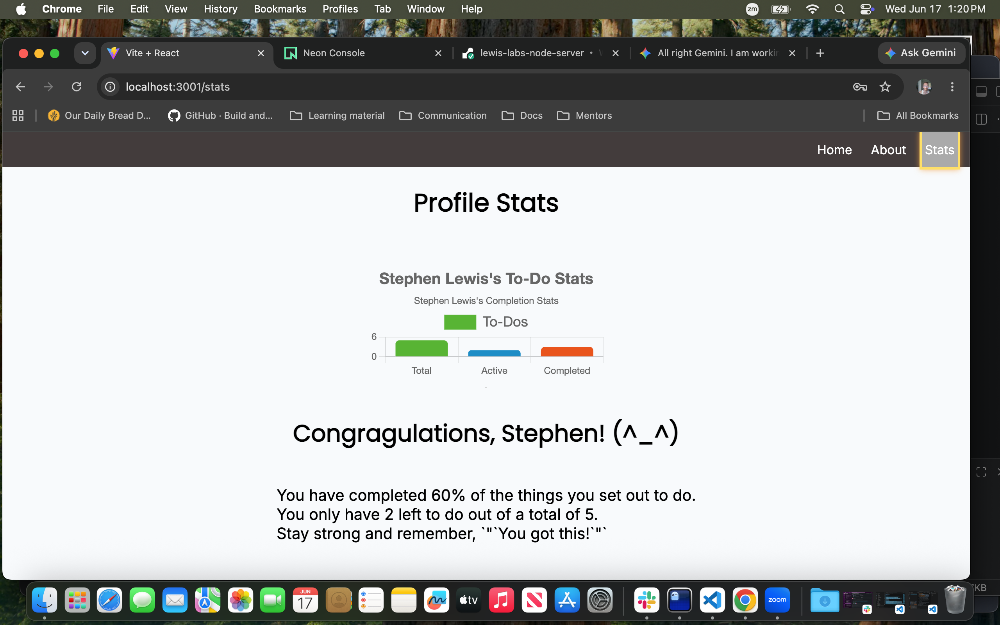

# Table Of Contents

1. [Live Demo](#live-demo)
2. [Project and Description](#project-and-description)
3. [Features](#features)
4. [Future Features](#future)
5. [Tech Used](#tech-used)
6. [Screen Shots](#screen-shots)
7. [Getting Started](#getting-started)
8. [Prerequisites](#prerequisites)
9. [Design Decission](#design-decission)
10. [License Info](#license-info)
11. [Thanks](#thanks)
12. [Contact](#-contact)
13. [Special Thanks](#special-thanks)

## Live Demo

[Node Server](https://lewis-labs-node-server.onrender.com)

## Project and Description

This is a back-end server built with Node.js and Express. It connects to a to-do list front-end application and handles all communication with the database. To keep user data safe and secure, the server uses JSON Web Tokens (JWT) for authentication and CSRF tokens to prevent unauthorized requests. The server also includes a statistics endpoint that provides insights into user activity, such as the number of completed tasks and the average time taken to complete tasks. This allows users to track their productivity and identify areas for improvement. Overall, this server is designed to provide a secure and efficient back-end for a to-do list application, ensuring that user data is protected while also providing valuable insights into user activity.

## Features

The server handles all CRUD (Create, Read, Update, Delete) operations for the to-do list with the following capabilities:

- Login and Registration: Users can choose to use google to register or logon, or they can create an account with an email and password.
- Add To-Do: Create and save new tasks to the database.
- Edit To-Do: Update the details of existing tasks.
- Delete To-Do: Remove a single task from the list.
- Bulk Delete: Clear out multiple selected tasks all at once.
- Search: Find specific tasks quickly using search keywords.
- Organize and Filter: Sort your tasks alphabetically by title or filter them by whether they are complete or incomplete.

### Things this application can do

## Future Features

Here are the features planned for future updates to the app:

- Custom Backgrounds: Give users the ability to personalize the app by changing the background colors.
- Nested Folders: Group tasks into separate folders for specific categories (like "Grocery List" or "Camping Trip").
- Calendar Integration: Set due dates for tasks and view them clearly on a calendar.
- Smart Priorities: Automatically raise a task's priority level as its due date gets closer.

## Tech Used

Here are the tools and technologies used to build this backend project:

- Visual Studio Code: The code editor used to write the application.
- Node.js & Express: The JavaScript environment and framework used to build the server.
- PostgreSQL: The database used to store all the to-do list data.
- Prisma: The database tool (ORM) used to easily connect and talk to PostgreSQL.
- Postman: The app used to test the server's API routes and make sure everything works.
- Jest: The testing framework used to run automated code tests.

### The technology I used/learned for this project

- PostgreSQL: The database used to store all the to-do list data.
- Prisma: The database tool (ORM) used to connect and talk to PostgreSQL.
- Postman: The app used to test the server's API routes.
- Jest: The testing framework used to run automated code tests.

## Screen Shots

1. <details>
     <summary>Login Page</summary>
     
   </details>
1. <details>
     <summary>Home Page (top)</summary>
     
   </details>
1. <details>
     <summary>Home Page (bottom)</summary>
     
   </details>
1. <details>
     <summary>Stats Page</summary>
     
   </details>

## Getting Started

First and foremost, you need to clone the repository to your local machine. You will also need to set up a PostgreSQL database and configure the connection settings in the project. Once you have the database set up, you can install the necessary dependencies using npm and start the development server. The server will run locally on your machine, allowing you to test the API endpoints and ensure everything is working correctly.

### Prerequisites

To run this project, you need to have the following tools installed and set up on your computer:

- Terminal: Built-in on your Mac to run commands.
- Visual Studio Code: Or another text editor to view and edit the code.
- Node.js: The runtime environment needed to run the Express server.
- PostgreSQL: The database software to host the data locally.

### Installation

1. **Clone the Repo:**

   ```bash
   git clone <repository-url>
   ```

   [link to the repo](git@github.com:WizardOfWhimsical/node-homework.git)

2. **Navigate to the Project Directory:**
   Run this script in your terminal for your project directory:
   ```bash
   npm install
   ```

#### **Note:** Make sure you install the chalk package version 4.1.2 to avoid compatibility issues with the current version of Node.js.

3. **Running the Development Server**
   Again, make sure you have your PostgreSQL database set up and the connection settings strings configured in the project. Start the local dev server with:

   ```
   npm run dev
   ```

   Open your browser and go to the Local URL displayed in the terminal (typically http://localhost:3001).

## Design Decision

My approach was shaped by a simple principle. A straightforward app shouldn’t
be complicated with color schemes, background images, or fancy button gradients.
I haven’t added any real color yet, though I do have a `:root` set up in my
global stylesheet for when the time comes. For now, you’ll see just a few
boxes to help distinguish key areas like the login and to-do sorting.

For statistics, I imported a bar chart component ([click to see refrence](https://www.geeksforgeeks.org/reactjs/how-to-implement-barchart-in-reactjs)). I used it because I thought it would be cool to show the stats this way. Also if felt more direct. I did run into some trouble with nested object labeling (the initial example I found was outdated), but the README documentation helped me resolve it.

When it comes to responsive web design, I believe flexbox is "The Boss". It’s
the quickest and most flexible way to start with mobile-first design.

I hope you enjoy the end product! <3

Here is a link to the front end i created for this project: [To-Do List Front End](git@github.com:WizardOfWhimsical/node-front-end.git)

## Licence

MIT License

Copyright (c) 2026 Lewis Labs

Permission is hereby granted, free of charge, to any person obtaining a copy
of this software and associated documentation files (the "Software"), to deal
in the Software without restriction, including without limitation the rights
to use, copy, modify, merge, publish, distribute, sublicense, and/or sell
copies of the Software, and to permit persons to whom the Software is
furnished to do so, subject to the following conditions:

The above copyright notice and this permission notice shall be included in
all copies or substantial portions of the Software.

THE SOFTWARE IS PROVIDED "AS IS", WITHOUT WARRANTY OF ANY KIND, EXPRESS OR
IMPLIED, INCLUDING BUT NOT LIMITED TO THE WARRANTIES OF MERCHANTABILITY,
FITNESS FOR A PARTICULAR PURPOSE AND NONINFRINGEMENT. IN NO EVENT SHALL
THE AUTHORS OR COPYRIGHT HOLDERS BE LIABLE FOR ANY CLAIM, DAMAGES OR OTHER
LIABILITY, WHETHER IN AN ACTION OF CONTRACT, TORT OR OTHERWISE, ARISING FROM,
OUT OF OR IN CONNECTION WITH THE SOFTWARE OR THE USE OR OTHER DEALINGS IN
THE SOFTWARE.

## 📬 Contact

- 📨 **Yahoo:** [My Yahoo Email](mailto:st.rayis1085@yahoo.com)
- 📧 **Gmail:** [My Gmail](mailto:st.rayis1085@gmail.com)
- 🐙 **GitHub:** [The Wizards Domain](https://github.com/WizardOfWhimsical)
- 🔗 **LinkedIn:** [Stephen Raymond Lewis](https://linkedin.com/in/stephenrlewis)

## Special Thanks

- [EJ Mason](https://github.com/mxmason) - My mentor and guide through this project, providing invaluable insights and support.
- [CTD Team](https://www.ctd.academy/) - For creating an amazing curriculum and fostering a supportive learning environment.
- [My Peers](https://www.ctd.academy/) - For their camaraderie, collaboration, and shared learning experiences throughout this journey.

## License

Copyright (c) 2025 Code the Dream
This project is licensed under the MIT License – see the [LICENSE](./LICENSE) file for details.
